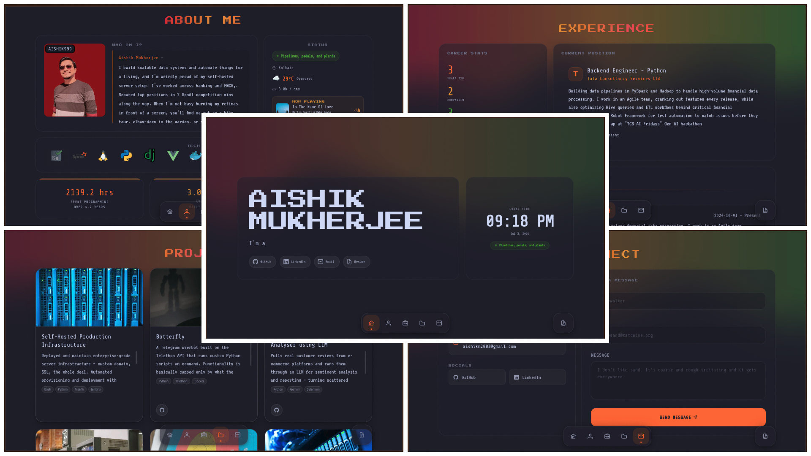

# Portfolio Website



<br><br>
A full-stack developer portfolio built with **Vue + Vite** on the frontend
and a **Django REST Framework** API on the backend. Content (profile, tech
stack, experience, projects, contact messages) is served dynamically from the
API rather than hardcoded into the frontend, and the site includes a few
live widgets — WakaTime coding stats, current weather, and a "now playing"
music widget.

## Features

- 🧑‍💻 Dynamic profile, tech stack, work experience, and project sections powered by a Django API
- 📬 Contact form that stores messages in the database
- ⏱️ WakaTime coding-activity chart, stats, and language breakdown
- 🌤️ Live weather widget (Open-Meteo)
- 🎵 "Now playing" widget (LastFM). I use [LastFM cache API](https://github.com/AISHIK999/lastfm_recently_played_api)
- 🎨 Animated UI (GSAP, Motion) using [VueBits](https://vue-bits.dev/)
- 🗂️ Django admin for managing profile, experience, project, and tech-stack content

## Tech Stack

**Frontend**
- Vue, Vue Router, TypeScript
- Vite, Tailwind CSS
- VueBits, Axios, GSAP, Motion, Chart.js

**Backend**
- Django, Django REST Framework
- PostgreSQL (via NeonDB - `dj-database-url`, `psycopg`)
- django-cors-headers, Whitenoise

**Hosting**
- Vercel (frontend and backend deployed as separate projects)
- Neon (managed Postgres)

## Project Structure

```
portfolio-website/
├── backend/                # Django REST API
│   ├── api/                 # Models, serializers, views, admin for portfolio data
│   ├── portfolio/            # Django project settings, URLs, WSGI/ASGI
│   ├── manage.py
│   ├── requirements.txt / pyproject.toml
│   └── vercel.json
└── frontend/                # Vue + Vite
    ├── src/
    │   ├── api/              # Axios calls to the backend API
    │   ├── components/
    │   ├── composables/       # Widget data-fetching (weather, now playing, waka)
    │   └── router/
    ├── package.json
    └── vercel.json
```

## Getting Started

### Prerequisites

- Node.js `^20.19.0` or `>=22.12.0`
- Python `3.12`
- A PostgreSQL database (e.g. a free [Neon](https://neon.tech) instance)

### 1. Clone the repo

```bash
git clone https://github.com/AISHIK999/portfolio-website.git
cd portfolio-website
```

For the environment variables in the next step-
- For `settings.py` either make changes in the `.env` file and import, or hardcore
- For `.env` in frontend, make necessary changes

### 2. Backend setup

```bash
cd backend
python -m venv .venv
source .venv/bin/activate      # Windows: .venv\Scripts\activate
pip install -r requirements.txt
```

Create `backend/.env.local`:

```env
SECRET_KEY=your-secret-key
DEBUG=True
ALLOWED_HOSTS=localhost,127.0.0.1
CORS_ALLOWED_ORIGINS=http://localhost:5173
CSRF_TRUSTED_ORIGINS=http://localhost:5173
DATABASE_URL=postgres://<user>:<password>@<host>/<db>?sslmode=require
```

Then run migrations and start the dev server:

```bash
python manage.py migrate
python manage.py createsuperuser
python manage.py runserver
```

The API will be available at `http://localhost:8000/api/`, with the admin at
`http://localhost:8000/admin/`.

### 3. Frontend setup

```bash
cd frontend
npm install
```

Create `frontend/.env`:

```env
VITE_API_BASE_URL=http://localhost:8000/api   ---> Django API endpoint
VITE_BACKEND_BASE_URL=http://localhost:8000   ---> Django endpoint
VITE_WAKA_BASE_URL=https://wakatime.com/share/@your-wakatime-username     ---> Self explainable ;)
VITE_NOW_PLAYING_URL=https://your-now-playing-endpoint/     ---> Endpoint from https://github.com/AISHIK999/lastfm_recently_played_api
VITE_WEATHER_API_URL=https://api.open-meteo.com/v1/forecast?latitude=<lat>&longitude=<long>&current_weather=true      ---> Lat and long of the city to show the time and weather of
VITE_WAKA_CHART_ID=your_wakatime_chart_embeddable_filename      ---> Wakatime json embeddable filename for "Coding Activity over Last 7 Days"
VITE_WAKA_STATS_ID=your_wakatime_stats_embeddable_filename      ---> Wakatime json embeddable filename for "Coding Activity over All Time"
VITE_WAKA_LANGS_ID=your_wakatime_langs_embeddable_filename      ---> Wakatime json embeddable filename for "Languages over All Time"
```

Then start the dev server:

```bash
npm run dev
```

The site will be available at `http://localhost:5173`.

## Deployment

The app deploys as two separate Vercel projects (`backend` and `frontend`
root directories) backed by a Neon Postgres database.

## License

Distributed under the MIT License. See [`LICENSE`](./LICENSE) for details.
